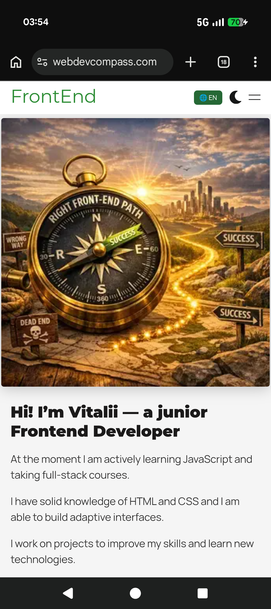
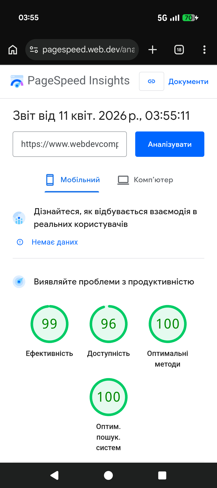

# Мій Професійний Frontend-Hub — Next.js Portfolio

Це моє персональне портфоліо, розроблене з фокусом на технічну досконалість, високу швидкість завантаження та сучасні стандарти розробки.

## 🚀 Технічні переваги та якість
Сайт є прикладом високоякісної верстки та програмування:
- **Продуктивність:** Показник **95+ балів** (Lighthouse) за швидкість, доступність та SEO.
- **Валідність:** Повністю валідний код, що відповідає сучасним стандартам W3C.
- **Оптимізація:** Швидке завантаження завдяки Server-Side Rendering (SSR) та оптимізації зображень.

## 🛠 Технологічний стек
У проекті використано сучасний набір інструментів професійного розробника:
- **Framework:** [Next.js](https://nextjs.org/) — для максимальної швидкості та SEO-оптимізації.
- **Мова:** [TypeScript](https://www.typescriptlang.org/) — гарантує стабільність та чистоту коду.
- **Стилізація:** [SCSS Modules](https://sass-lang.com/) — для гнучкої та модульної архітектури стилів.
- **Адаптивність:** Mobile-First дизайн, що ідеально працює на будь-яких екранах.

## 📂 Що всередині?
- **Приклади робіт:** Динамічний розділ з моїми проектами та кейсами.
- **Інтерактив:** Плавна анімація та логіка "Show More" для комфортного перегляду.
- **Чистий код:** Проект розроблений з можливістю легкої підтримки та масштабування.

## 🏁 Як переглянути локально
1. `npm install` — встановлення всіх необхідних пакетів.
2. `npm run dev` — запуск локального сервера для розробки.
3. `npm run build` — створення оптимізованої версії для продакшену.

---
*Розроблено мною з використанням найкращих практик сучасного вебу.*
### 📊 Підтвердження якості (Google Lighthouse)
Ось офіційні результати тестування мого сайту на продуктивність та відповідність стандартам:

